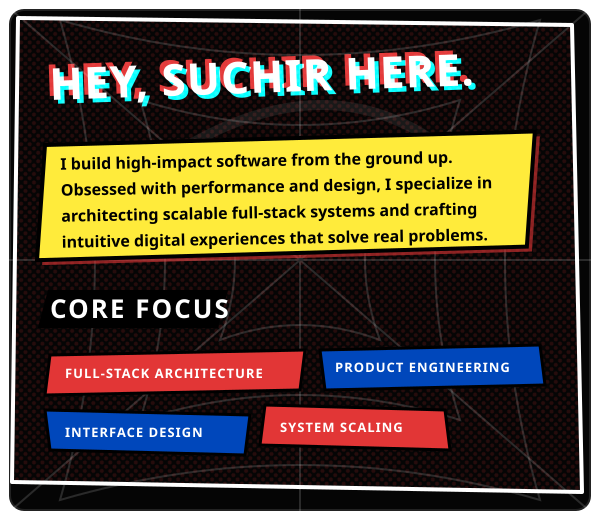
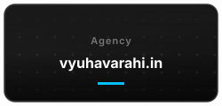
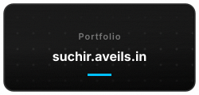
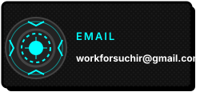
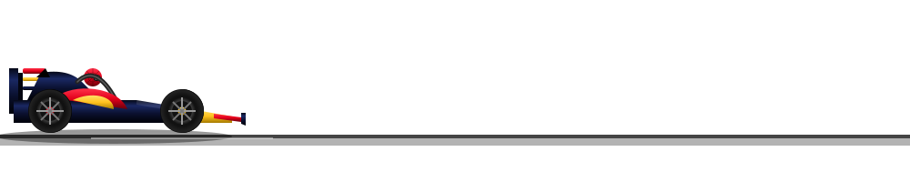

  

  <!-- Driver Intro & Podium Section -->
  <table width="100%" border="0" cellspacing="0" cellpadding="0" style="border-collapse: collapse;">
    <tr>
      <td width="50%" align="center" valign="middle" style="padding: 10px;">
        
      </td>
      <td width="50%" align="center" valign="middle">
        
      </td>
    </tr>
  </table>
   

  <!-- 🚦 F1 Start Lights (Tech Stack) -->
  
  
    
  
  <!-- 📟 Telemetry Contact Display (Clickable Cards) -->
  

    
      
    
    
    
    
  

  
   
  
  <!-- Animated F1 Car -->
  

